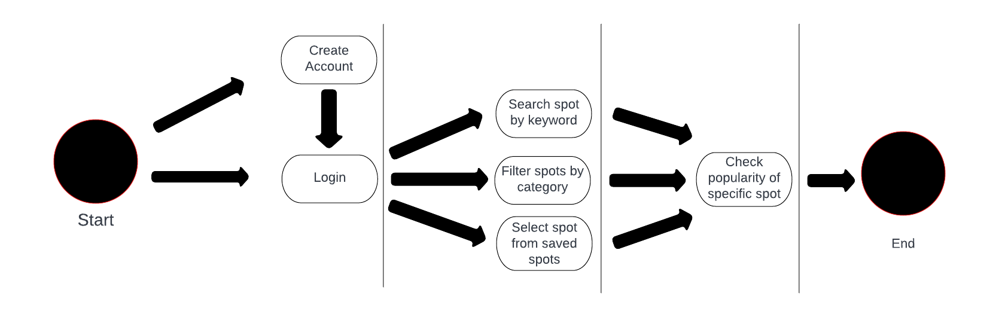
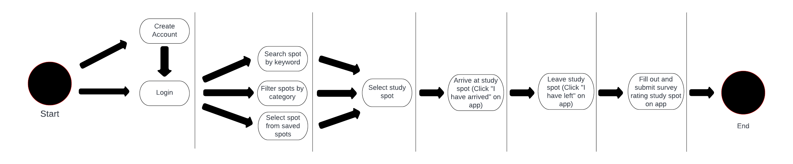

# Specification Phase Exercise

A little exercise to get started with the specification phase of the software development lifecycle. See the [instructions](instructions.md) for more detail.

## Team members

Ankit Jain - [Link to github profile](https://github.com/ankit181818)  
Anvi Agarwal - [Link to github profile](https://github.com/agarwalanvi01)  
Kevin Gong - [Link to github profile](https://github.com/kxg202)

## Stakeholders

**Stakeholder Interview with Neha, NYU grad student**
	
**Where do you currently go to study and complete any assignments or work you have?**
	
I usually prefer to go to different buildings on campus, Bobst library, and coffee shops nearby school so that I can do work in between classes and other activities. I also occasionally study at home in my apartment, although I find it less suited to my needs because I don’t have much space or quiet, so I prefer to be near or on campus.

**Do you ever have problems with finding a study space on campus? How long does it take you to find somewhere to study?**

I often have problems finding somewhere to study on campus; I usually check the library first, but finding a chair during the daytime can be next to impossible on any floor, let alone one of the quiet ones. Further, booking a room to work on a group project can be difficult, especially because the app to book is difficult to use. I also don’t always have time to check all the other buildings on campus for availability or find a new place to study (like a coffee shop) in between classes. Sometimes it can take me up to 40 minutes to find a good place, which really cuts into the total time I have to do my work. 

**Is there anything about the current system for finding a space that you wish would change? What frustrates you about the current system?**

I wish I could see the availability of more study spaces that are less traditional, like the seats at the Starbucks’ or Think Coffee’s nearby. I also wish I could see what other students think of the spaces, ie. whether they’re a bit noisy, if they’re good for group projects, taking a meeting, or convenient locations. I wish I could see which study spaces are closest and the best rated near wherever I am. I find it frustrating that the current system makes it difficult to book rooms and that it only includes a fraction of the places to study on campus. 

**What are the criteria you look for in a study/work space?**

I look for different things on different occasions. When I have a long assignment to complete that requires attention to detail and focus, I prefer to be in a space that’s quiet and has little distraction. Otherwise, I look for a communal environment with some noise and daylight (windows), such as a common area or coffee shop. Occasionally, I want to be in a room by myself to take a meeting or call, or in a separate room for a group project. 

**What would you like to know in order to find the space best suited for your needs?**

I want to know the location in relation to me, how many seats there are total and available, how noisy/quiet it is, the amenities available in the space, and how other students like the space. 

**User Goals/Needs:**
-Find an open study space on campus
-Be able to find a space quickly
-Be able to find a place near their location and according to their specific needs
-Be able to see information about amenities and student opinions on quality of study space

**User Frustrations:**
-Only traditional spaces available on existing apps, ie. library. Not other campus buildings or coffee shops
-It takes too long to find an open study space
-Don’t know about amenities and quality of space before arriving
-Hard to find new places that they don’t already know about

## Product Vision Statement

Our app gives users the ability to discover new study spots, filter by keyword and category and check the current population of existing spaces, and leave reviews on the quality of the space.

## User Requirements

1. As an existing user I want to check the current amount of people in a study space so I know which spots are less crowded

2. As an existing user I want to be able to check which study spaces have accessories such as printers, charging spots, etc so I can fulfill my need to use these accessories.

3. As an existing user, I want to rate study spots, so other users can know where the best ones are

4. As an existing user, I want to check the availability (open, closed for maintenance, etc) of a study space so I can study there

5. As an existing user, I want to search for study spaces by my location so I can find spaces conveniently near me

6. As an existing user, I want to search for study spaces by category so I can find spaces more suited to my needs

7. As a new user, I want to create an account so that I can keep track of my study spaces

8. As an existing user, I want to search for study spaces by name so that I can find specific spaces that I may enjoy

9. As an existing user, I want to add new spaces to the app so that I can keep track of how busy they are

10. As an existing user, I want to update a space’s availability so that other users can be well informed

## Activity Diagrams

User Story: As an existing user I want to check the current amount of people in a study space

User Story: As an existing user, I want to rate study spots, so other users can know where the best ones are

